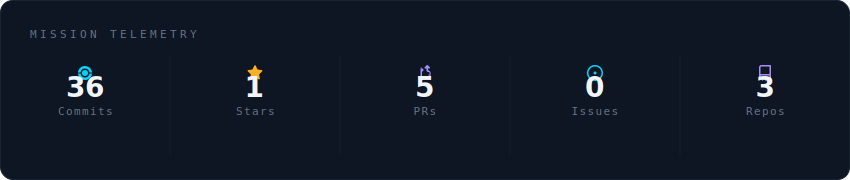

<!-- Galaxy Profile README Template
     Customize this file with your own info, then rename it to README.md
     in your GitHub profile repo (github.com/YOUR_USERNAME/YOUR_USERNAME).
     The SVG paths below point to assets/generated/ which are auto-generated
     by the GitHub Actions workflow or by running: python -m generator.main -->

  

 

  

 

  

 

<strong>More about me</strong>

 

Frontend developer and Computer Science student building interactive and data-driven web applications.
Focused on Frontend development, UI design, and real-world system development.

**Currently a** Computer Science student at Polytechnic University of the Philippines

 

  
  

